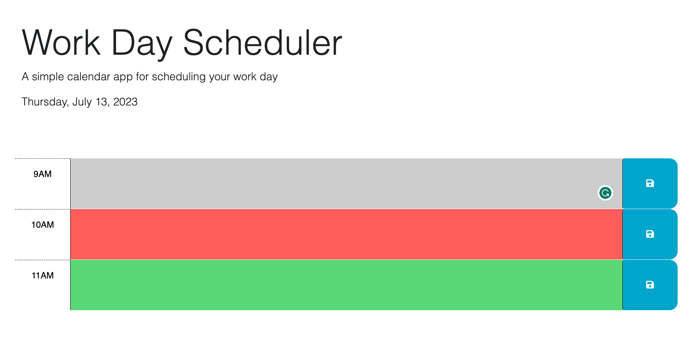

# JavaScript Calendar - Challenge 05

## User Story -->
_US:_
AS AN employee with a busy schedule
I WANT to add important events to a daily planner
SO THAT I can manage my time effectively
## Acceptance Criteria -->
_AC:_

GIVEN I am using a daily planner to create a schedule
WHEN I open the planner
THEN the current day is displayed at the top of the calendar
WHEN I scroll down
THEN I am presented with time blocks for standard business hours of 9am to 5pm
WHEN I view the time blocks for that day
THEN each time block is color-coded to indicate whether it is in the past, present, or future
WHEN I click into a time block
THEN I can enter an event
WHEN I click the save button for that time block
THEN the text for that event is saved in local storage
WHEN I refresh the page
THEN the saved events persist
## Screenshots of the Webpage:
### Start of the game -->

### Playing the game -->

### Game Over -->

## Important Notes:

## Here's the link to the deployed Webpage:
